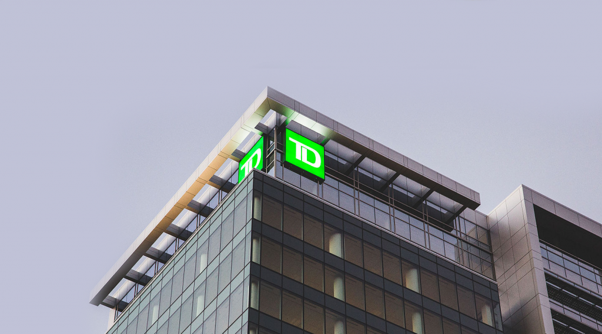

## Professional/Career

Five years after graduating, I want to be able to tell my classmates that I have continued to grow my career at TD Bank. I originally started at TD in a customer experience role while I was in university, and after graduating, I used my experience and connections within the company to move into a UX design role. I now work full-time in UX and have helped improve TD's website, EasyWeb, and mobile banking experiences. My experience working directly with customers has helped me understand their needs and solve design problems that make digital banking easier and more accessible.
