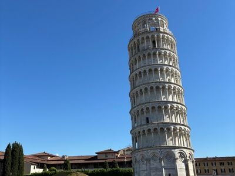

## Recreational

Five years after graduating, I want to be able to tell my classmates that I have continued travelling and experiencing different parts of the world. During my university experience, I travelled to Italy, and after graduating, I continued exploring Europe by visiting Spain, Portugal, France, Barcelona, etc. Travelling has become something that I make time for every year, whether I am travelling with my family, friends, or my partner. Even after starting a full-time career, I have continued to make time for experiences outside of work and balance my career with my personal life. Travelling has allowed me to experience different cultures, try new foods, visit places I have always wanted to see, and create memories with the people who are important to me. It has also helped me become more independent and more educated about different languages, cultures, and design decisions in every country. Travelling has improved my UX design work because it gives me different perspectives in design to inspire my own work and thinking. 
