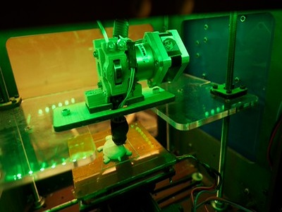

## Entrepreneurial/Business

Five years after graduating, I want to be able to tell my classmates that I have successfully continued growing my 3D printing service business (3djellyprints.com) that I started during university. I originally started the business because I was interested in designing and building websites and wanted to create a real business where I could apply my design skills outside of school for my personal portfolio. This led me to combine my interest in UX and website design with 3D printing and turn it into my own small business. Over the past five years, I have gained more customers, completed more custom projects, and expanded the services that I provide. I have also built relationships with returning customers and gained new customers through recommendations and networking. Through starting my 3d printing business, I have learnt how to communicate better with customers, manage orders, set prices, promote my services, meet deadlines, and solve problems professionally. I have also learned how important it is to listen to customer feedback and make changes based on what customers actually need. As my UX experience has grown, I have continued redesigning and improving the 3DJellyPrints website to make it easier for customers to understand my services, request quotes, upload their designs, and place custom orders. I can now look at the business from both the perspective of a business owner and a UX designer.
