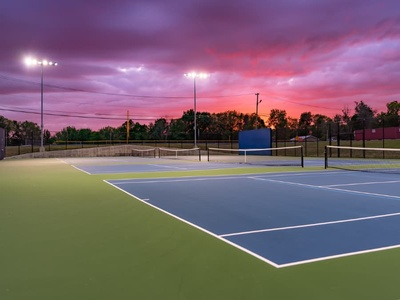

## Health/Wellness

Five years after graduating, I want to be able to tell my classmates that I have continued to prioritize my health by staying active and playing the sports that I enjoy. I regularly play tennis, badminton, table tennis, and pickleball on the weekends to keep myself healthy and active. Since I work full-time in UX and spend a lot of my workday indoors at a desk and computer, playing sports has helped me maintain a better work-life balance and gives me something active to look forward to outside of work. Racquet sports have been a passion of mine for many years. In high school, I competed in table tennis and placed second in a regional girls' competition in 2023, and during university, I continued playing badminton. Over the past five years, I have continued going to recreational centres to play, practise, and sometimes compete with other people. Staying involved in sports has helped me stay healthy, meet new people, reduce stress, and continue a passion that has been part of my life since before university.
